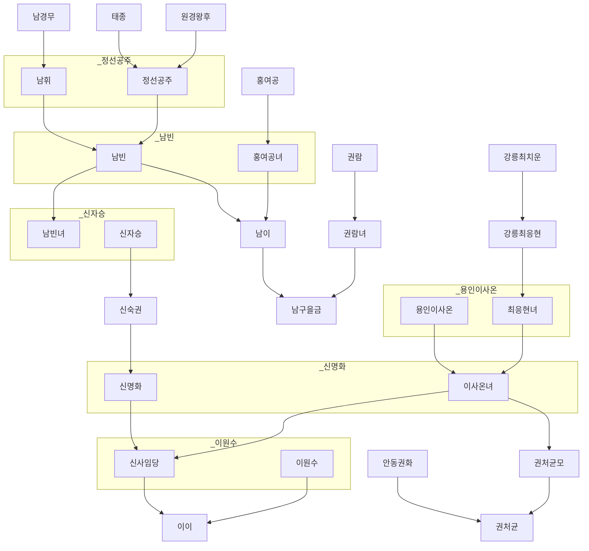

```mermaid
graph TD

    남경무 --> 남휘 --> 남빈
    태종 --> 정선공주 --> 남빈
    원경왕후 --> 정선공주
    남빈 --> 남이 --> 남구을금
    권람 --> 권람녀 --> 남구을금
    홍여공 --> 홍여공녀 --> 남이


    남빈 --> 남빈녀 

    subgraph _남빈
        남빈
        홍여공녀
    end

    subgraph _신자승

        신자승
        남빈녀
    end

    subgraph _정선공주
        정선공주
        남휘
    end

    신자승 --> 신숙권 --> 신명화 --> 신사임당

    용인이사온 --> 이사온녀 --> 신사임당
    이사온녀 --> 권처균모

    subgraph _용인이사온
        용인이사온
        최응현녀
    end

    강릉최치운 --> 강릉최응현 --> 최응현녀 --> 이사온녀

    subgraph _이원수
        이원수
        신사임당
    end 

    신사임당 --> 이이
    이원수 --> 이이

    subgraph _신명화
        신명화
        이사온녀
    end

    안동권화 --> 권처균
    권처균모 --> 권처균

```    