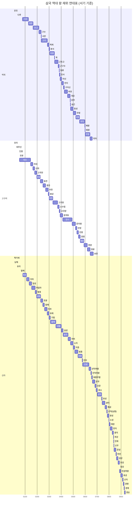

```mermaid
gantt
title 삼국 역대 왕 재위 연대표 (서기 기준)
dateFormat YYYY
axisFormat %Y

section 백제
온조 : 0001, 0029
다루 : 0029, 0077
기루 : 0077, 0128
개루 : 0128, 0166
초고 : 0166, 0214
구수 : 0214, 0234
사반 : 0234, 0235
고이 : 0234, 0286
책계 : 0286, 0298
분서 : 0298, 0304
비류 : 0304, 0344
계 : 0344, 0346
근초고 : 0346, 0375
근구수 : 0375, 0384
침류 : 0384, 0385
진사 : 0385, 0392
아신 : 0392, 0405
전지 : 0405, 0420
구이신 : 0420, 0427
비유 : 0427, 0454
개로 : 0454, 0475
문주 : 0475, 0477
삼근 : 0477, 0479
동성 : 0479, 0501
무령 : 0501, 0523
성왕 : 0523, 0554
위덕 : 0554, 0598
혜왕 : 0598, 0599
법왕 : 0599, 0600
무왕 : 0600, 0641
의자 : 0641, 0660

section 고구려
유리 : 0001, 0018
대무신 : 0018, 0044
민중 : 0044, 0048
모본 : 0048, 0053
태조 : 0053, 0146
차대 : 0146, 0165
신대 : 0165, 0179
고국천 : 0179, 0197
산상 : 0197, 0227
동천 : 0227, 0248
중천 : 0248, 0270
서천 : 0270, 0292
봉상 : 0292, 0300
미천 : 0300, 0331
고국원 : 0331, 0371
소수림 : 0371, 0384
고국양 : 0384, 0391
광개토 : 0391, 0413
장수 : 0413, 0491
문자명 : 0491, 0519
안장 : 0519, 0531
안원 : 0531, 0545
양원 : 0545, 0559
평원 : 0559, 0590
영양 : 0590, 0618
영류 : 0618, 0642
보장 : 0642, 0668

section 신라
혁거세 : 0001, 0004
남해 : 0004, 0024
유리 : 0024, 0057
탈해 : 0057, 0080
파사 : 0080, 0112
지마 : 0112, 0134
일성 : 0134, 0154
아달라 : 0154, 0184
벌휴 : 0184, 0196
내해 : 0196, 0230
조분 : 0230, 0247
첨해 : 0247, 0261
미추 : 0262, 0284
유례 : 0284, 0298
기림 : 0298, 0310
흘해 : 0310, 0356
내물 : 0356, 0402
실성 : 0402, 0417
눌지 : 0417, 0458
자비 : 0458, 0479
소지 : 0479, 0500
지증 : 0500, 0514
법흥 : 0514, 0540
진흥 : 0540, 0576
진지 : 0576, 0579
진평 : 0579, 0632
선덕여왕 : 0632, 0647
진덕여왕 : 0647, 0654
태종무열 : 0654, 0661
문무 : 0661, 0681
신문 : 0681, 0692
효소 : 0692, 0702
성덕 : 0702, 0737
효성 : 0737, 0742
경덕 : 0742, 0765
혜공 : 0765, 0780
선덕(남왕) : 0780, 0785
원성 : 0785, 0798
소성 : 0798, 0800
애장 : 0800, 0809
헌덕 : 0809, 0826
흥덕 : 0826, 0836
희강 : 0836, 0838
민애 : 0838, 0839
신무 : 0839, 0840
문성 : 0840, 0857
헌안 : 0857, 0861
경문 : 0861, 0875
헌강 : 0875, 0886
정강 : 0886, 0887
진성여왕 : 0887, 0897
효공 : 0897, 0912
신덕 : 0912, 0917
경명 : 0917, 0924
경애 : 0924, 0927
경순 : 0927, 0935
```