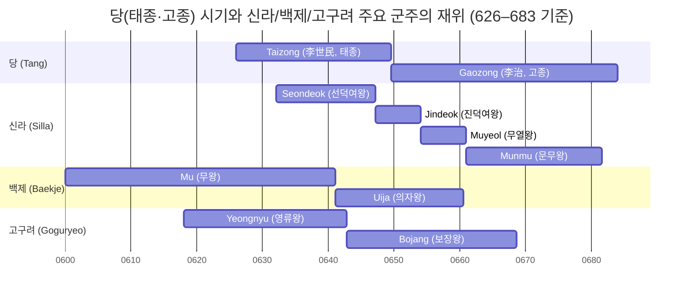

```mermaid
gantt
  title 당(태종·고종) 시기와 신라/백제/고구려 주요 군주의 재위 (626–683 기준)
  dateFormat  YYYY-MM-DD
  axisFormat  %Y

  section 당 (Tang)
  Taizong (李世民, 태종)      : t1, 0626-01-01, 0649-07-10
  Gaozong (李治, 고종)       : t2, 0649-07-15, 0683-12-27

  section 신라 (Silla)
  Seondeok (선덕여왕)        : s1, 0632-01-01, 0647-02-20
  Jindeok (진덕여왕)         : s2, 0647-02-20, 0654-01-01
  Muyeol (무열왕)            : s3, 0654-01-01, 0661-01-01
  Munmu (문무왕)             : s4, 0661-01-01, 0681-08-21

  section 백제 (Baekje)
  Mu (무왕)                  : b1, 0600-01-01, 0641-01-01
  Uija (의자왕)              : b2, 0641-01-01, 0660-07-18

  section 고구려 (Goguryeo)
  Yeongnyu (영류왕)          : g1, 0618-01-01, 0642-10-01
  Bojang (보장왕)            : g2, 0642-10-01, 0668-09-01
```