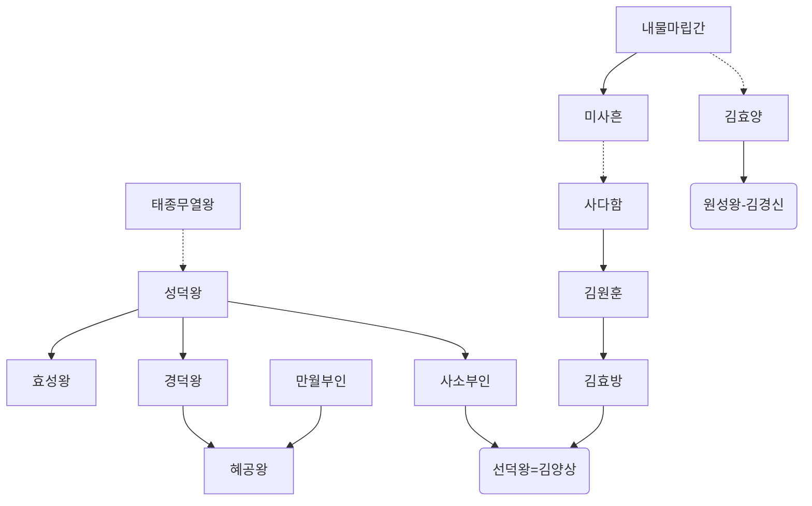

# 신라 혜공왕 주변 관계도

```mermaid
graph TD

태종무열왕 -.-> 성덕왕
성덕왕 --> 효성왕
성덕왕 --> 경덕왕 --> 혜공왕
만월부인 --> 혜공왕
내물마립간 --> 미사흔 -.-> 사다함 --> 김원훈 --> 김효방
성덕왕 --> 사소부인
사소부인 --> 선덕왕
김효방 --> 선덕왕(선덕왕=김양상)
내물마립간 -.-> 김효양 --> 원성왕(원성왕-김경신)


```

----

```mermaid
graph TD

일길찬김대공
이찬김대렴
아찬김융
김은거
이찬염상
정문
김경신(김경신=원성왕)
김양상(김양상=선덕왕)
김지정
혜공왕
김주원

```

