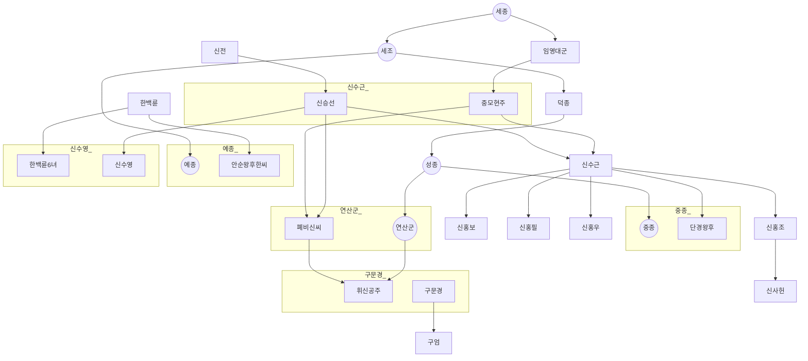

```mermaid

graph TD

 세종((세종)) --> 세조((세조)) --> 덕종 --> 성종((성종)) --> 연산군
 성종 --> 중종((중종))
 세조 --> 예종((예종))
 신승선 --> 폐비신씨
 중모현주 --> 폐비신씨

 연산군 --> 휘신공주
 폐비신씨 --> 휘신공주

 subgraph 구문경_
 구문경
 휘신공주
 end

 구문경 --> 구엄

 한백륜 --> 안순왕후한씨
 subgraph 예종_
 예종((예종))
 안순왕후한씨
 end
 한백륜 --> 한백륜6녀
 subgraph 신수영_
 신수영
 한백륜6녀
 end
 신승선 --> 신수영

 연산군((연산군))

 중종((중종))

 subgraph 신수근_
 신승선
 중모현주
 end

 세종 --> 임영대군 --> 중모현주 --> 신수근
 신전 --> 신승선 --> 신수근 --> 신홍보
 신수근 --> 신홍필
 신수근 --> 신홍조 --> 신사헌
 신수근 --> 신홍우
 
 신수근 --> 단경왕후
 subgraph 중종_
  중종
  단경왕후
 end

 subgraph 연산군_
 연산군
 폐비신씨
 end
```