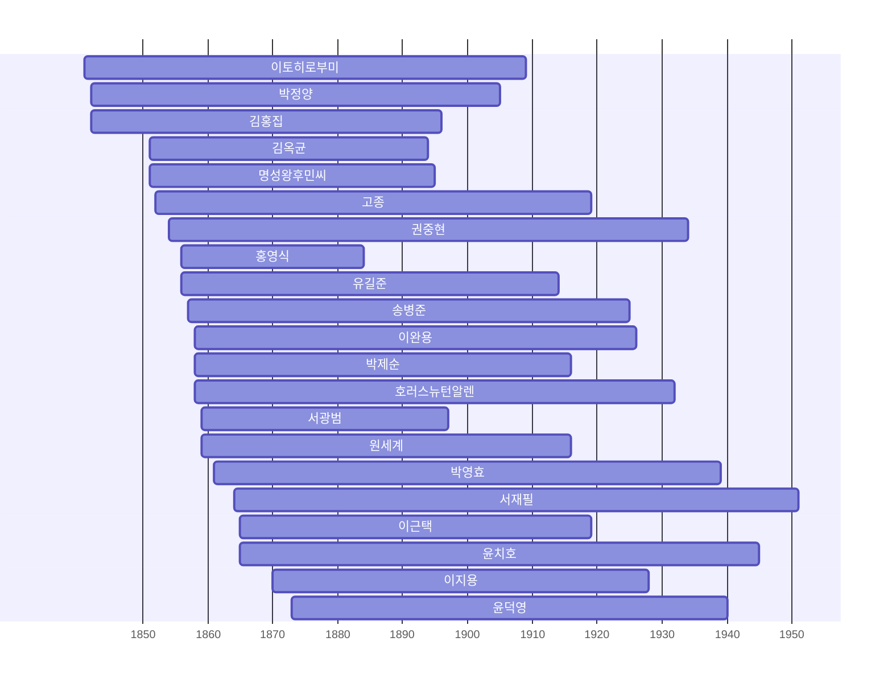
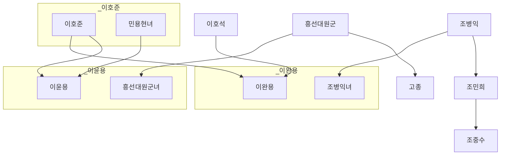

```mermaid
gantt

dateFormat YYYY
axisFormat %Y

이토히로부미 : 1841, 1909
박정양 : 1842, 1905
김홍집 : 1842, 1896
김옥균 : 1851, 1894
명성왕후민씨 : 1851, 1895
고종 : 1852, 1919
권중현 : 1854, 1934
홍영식 : 1856, 1884
유길준 : 1856, 1914
송병준 : 1857, 1925
이완용 : 1858, 1926
박제순 : 1858, 1916
호러스뉴턴알렌 : 1858, 1932
서광범 : 1859, 1897
원세계 : 1859, 1916
박영효 : 1861, 1939
서재필 : 1864, 1951
이근택 : 1865, 1919
윤치호 : 1865, 1945

이지용 : 1870, 1928
윤덕영 : 1873, 1940


```

```mermaid

graph TD

    이호석 --> 이완용
    이호준 --> 이완용
    이호준 --> 이윤용

    흥선대원군 --> 흥선대원군녀
    흥선대원군 --> 고종
    subgraph _이윤용
        이윤용
        흥선대원군녀
    end
    subgraph _이완용
        이완용
        조병익녀
    end 
    subgraph _이호준
        이호준
        민용현녀
    end
    민용현녀 --> 이윤용
    조병익 --> 조병익녀
    조병익 --> 조민희 --> 조중수


```
