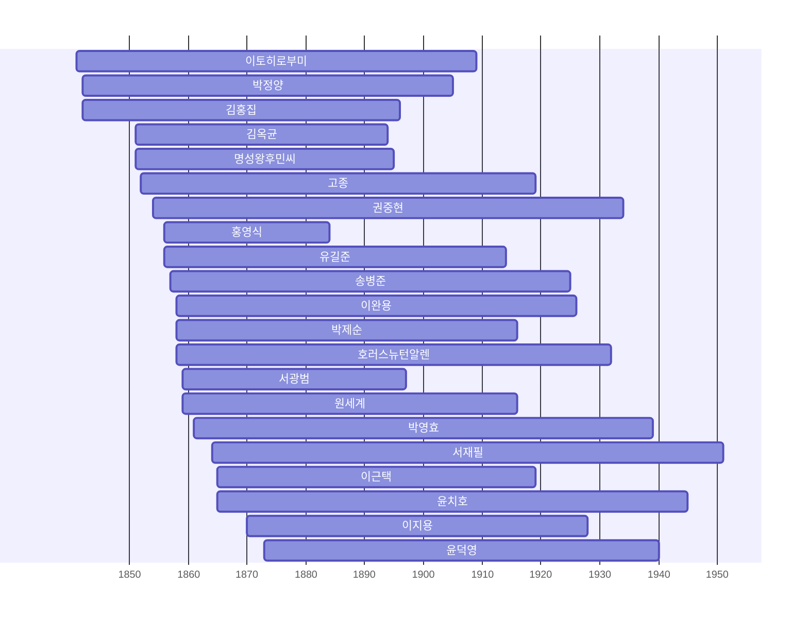

```mermaid
gantt

dateFormat YYYY
axisFormat %Y

이토히로부미 : 1841, 1909
박정양 : 1842, 1905
김홍집 : 1842, 1896
김옥균 : 1851, 1894
명성왕후민씨 : 1851, 1895
고종 : 1852, 1919
권중현 : 1854, 1934
홍영식 : 1856, 1884
유길준 : 1856, 1914
송병준 : 1857, 1925
이완용 : 1858, 1926
박제순 : 1858, 1916
호러스뉴턴알렌 : 1858, 1932
서광범 : 1859, 1897
원세계 : 1859, 1916
박영효 : 1861, 1939
서재필 : 1864, 1951
이근택 : 1865, 1919
윤치호 : 1865, 1945

이지용 : 1870, 1928
윤덕영 : 1873, 1940


```
