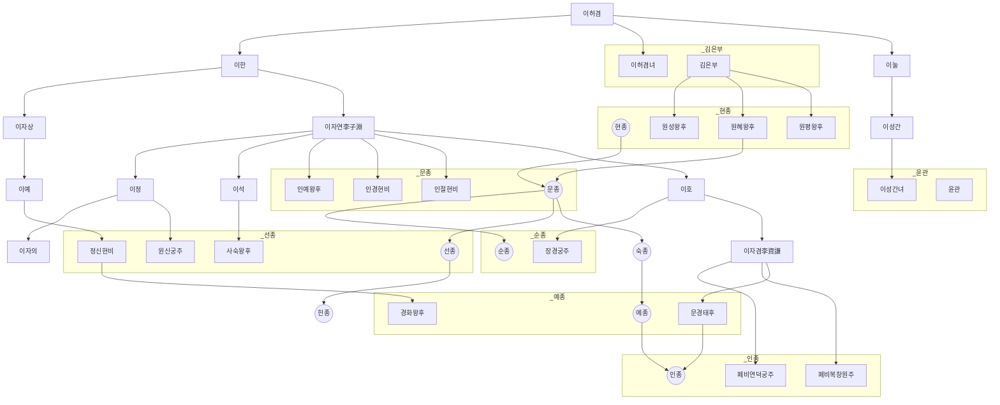

```mermaid
graph TD

    이허겸 --> 이한
    이허겸 --> 이허겸녀
    이허겸 --> 이눌 --> 이성간 --> 이성간녀

    subgraph _윤관
    이성간녀
    윤관
    end

    김은부
    subgraph _김은부
    김은부
    이허겸녀
    end

    현종((현종))
    문종((문종))
    순종((순종))
    숙종((숙종))
    인종((인종))
    예종((예종))
    선종((선종))
    헌종((헌종))

    subgraph _현종
    현종
    원성왕후
    원혜왕후
    원평왕후
    end

    subgraph _인종
    인종
    폐비연덕궁주
    폐비복창원주
    end

    이자겸 --> 폐비연덕궁주
    이자겸 --> 폐비복창원주

    현종 --> 문종
    김은부 --> 원성왕후
    김은부 --> 원혜왕후 --> 문종
    김은부 --> 원평왕후

    이자연[이자연李子淵]
    이자겸[이자겸李資謙]

    이자연 --> 이정
    이정 --> 이자의
    이정 --> 원신궁주
    이자연 --> 이석 --> 사숙왕후
    이자연 --> 인예왕후
    이자연 --> 인경현비
    이자연 --> 인절현비
    subgraph _문종
    문종
    인예왕후
    인경현비
    인절현비
    end

    subgraph _선종
    선종
    사숙왕후
    원신궁주
    정신현비
    end

    이한 --> 이자상 --> 이예 --> 정신현비 --> 경화왕후

    이한 --> 이자연 --> 이호
    이호 --> 장경궁주

    이호 --> 이자겸 --> 문경태후

    문종 --> 순종
    문종 --> 선종 --> 헌종
    문종 --> 숙종 --> 예종

    subgraph _순종
    순종
    장경궁주
    end
    
    subgraph _예종
    예종
    문경태후
    경화왕후
    end

    예종 --> 인종
    문경태후 --> 인종
```