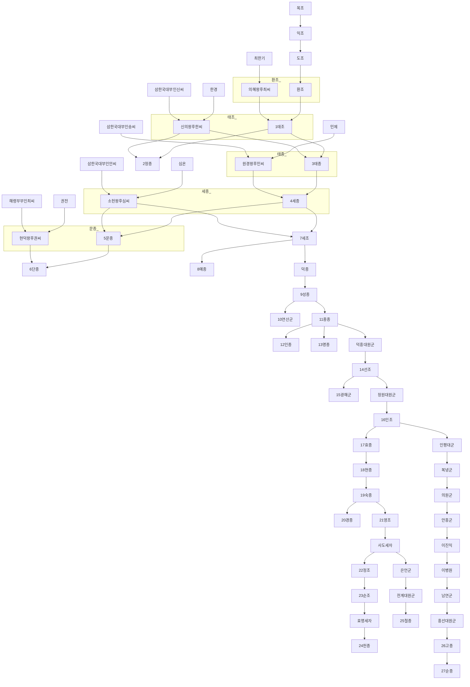

```mermaid
graph TD

목조-->익조-->도조-->환조-->1태조-->2정종
1태조-->3태종-->4세종-->5문종-->6단종
4세종-->7세조-->8예종
7세조-->덕종-->9성종-->10연산군
9성종-->11중종-->12인종
11중종-->13명종
11중종-->덕흥대원군-->14선조-->15광해군
14선조-->정원대원군-->16인조-->17효종-->18현종-->19숙종-->20경종
19숙종-->21영조-->사도세자-->22정조-->23순조-->효명세자-->24헌종
사도세자-->은언군-->전계대원군-->25철종
16인조-->인평대군-->복녕군-->의원군-->안흥군-->이진익-->이병원-->남연군-->흥선대원군-->26고종-->27순종

최한기 --> 의혜왕후최씨 --> 1태조

subgraph 환조_
    환조
    의혜왕후최씨
end

한경 --> 신의왕후한씨 --> 2정종
삼한국대부인신씨 --> 신의왕후한씨 --> 3태종

subgraph 태조_
    1태조
    신의왕후한씨
end

민제 --> 원경왕후민씨 --> 4세종
삼한국대부인송씨 --> 원경왕후민씨

subgraph 태종_
    3태종
    원경왕후민씨
end

심온 --> 소헌왕후심씨 --> 5문종
삼한국대부인안씨 --> 소헌왕후심씨 --> 7세조

subgraph 세종_
   4세종
   소헌왕후심씨
end

권전 --> 현덕왕후권씨 --> 6단종
해령부부인최씨 --> 현덕왕후권씨
subgraph 문종_
   5문종
   현덕왕후권씨
end
```

