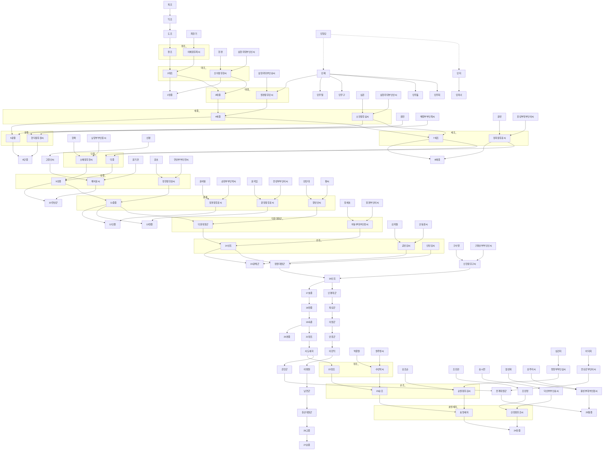

```mermaid
graph TD

목조-->익조-->도조-->환조-->1태조-->2정종
1태조-->3태종-->4세종-->5문종-->6단종
4세종-->7세조-->8예종
7세조-->덕종-->9성종-->10연산군
9성종-->11중종-->12인종
11중종-->13명종
11중종-->덕흥대원군-->14선조-->15광해군
14선조-->정원대원군-->16인조-->17효종-->18현종-->19숙종-->20경종
19숙종-->21영조-->사도세자-->22정조-->23순조-->효명세자-->24헌종
사도세자-->은언군-->전계대원군-->25철종
16인조-->인평대군-->복녕군-->의원군-->안흥군-->이진익-->이병원-->남연군-->흥선대원군-->26고종-->27순종

최한기 --> 의혜왕후최씨 --> 1태조

subgraph 환조_
    환조
    의혜왕후최씨
end

한경 --> 신의왕후한씨 --> 2정종
삼한국대부인신씨 --> 신의왕후한씨 --> 3태종

subgraph 태조_
    1태조
    신의왕후한씨
end

민제 --> 원경왕후민씨 --> 4세종
삼한국대부인송씨 --> 원경왕후민씨

민형모 -..-> 민제
민형모 -..-> 민지 --> 민지녀


민제 --> 민무질
민제 --> 민무구
민제 --> 민무휼
민제 --> 민무회

subgraph 태종_
    3태종
    원경왕후민씨
end

심온 --> 소헌왕후심씨 --> 5문종
삼한국대부인안씨 --> 소헌왕후심씨 --> 7세조

subgraph 세종_
   4세종
   소헌왕후심씨
end

권전 --> 현덕왕후권씨 --> 6단종
해령부부인최씨 --> 현덕왕후권씨

subgraph 문종_
   5문종
   현덕왕후권씨
end

subgraph 세조_
   7세조
   정희왕후윤씨
end

윤번 --> 정희왕후윤씨 --> 8예종
흥녕부대부인이씨 --> 정희왕후윤씨 --> 덕종

subgraph 덕종_
  덕종
  소혜왕후한씨
end

한확 --> 소혜왕후한씨 --> 9성종
남양부부인홍씨 --> 소혜왕후한씨

subgraph 성종_
   9성종
   폐비윤씨
   정현왕후윤씨
end

윤기견 --> 폐비윤씨 --> 10연산군
신평 --> 고령신씨 --> 폐비윤씨

윤호 --> 정현왕후윤씨 --> 11중종
연안부부인전씨 --> 정현왕후윤씨

subgraph 중종_
  11중종
  장경왕후윤씨
  문정왕후윤씨
  창빈안씨
end

윤여필 --> 장경왕후윤씨 --> 12인종
순천부부인박씨 --> 장경왕후윤씨

윤지임 --> 문정왕후윤씨 --> 13명종
전성부부인이씨 --> 문정왕후윤씨

안탄대 --> 창빈안씨 --> 덕흥대원군
황씨 --> 창빈안씨

subgraph 덕흥대원군_
  덕흥대원군
  하동부대부인정씨
end

정세호 --> 하동부대부인정씨 --> 14선조
정경부인이씨 --> 하동부대부인정씨


subgraph 선조_
  14선조
  공빈김씨
  인빈김씨
end 

김희철 --> 공빈김씨 --> 15광해군
안동권씨 --> 공빈김씨

인빈김씨 --> 정원대원군
구사맹 --> 인헌왕후구씨 --> 16인조
구평산부부인신씨 --> 인헌왕후구씨

subgraph 정조_
  22정조
  수빈박씨
end

박준원 --> 수빈박씨 --> 23순조
원주원씨 --> 수빈박씨

subgraph 순조_
  23순조
  순원왕후김씨
end
김조순 --> 순원왕후김씨 --> 효명세자
심건지 --> 청양부부인심씨 --> 순원왕후김씨

subgraph 효명세자_
  효명세자
  신정왕후조씨
end
조진관 --> 조만영 --> 신정왕후조씨 --> 24헌종
송시연 --> 덕안부부인송씨 --> 신정왕후조씨

이덕희 --> 전산군부인이씨 --> 전계대원군

염성화 --> 용성부대부인염씨 --> 25철종
상주지씨 --> 용성부대부인염씨
```

