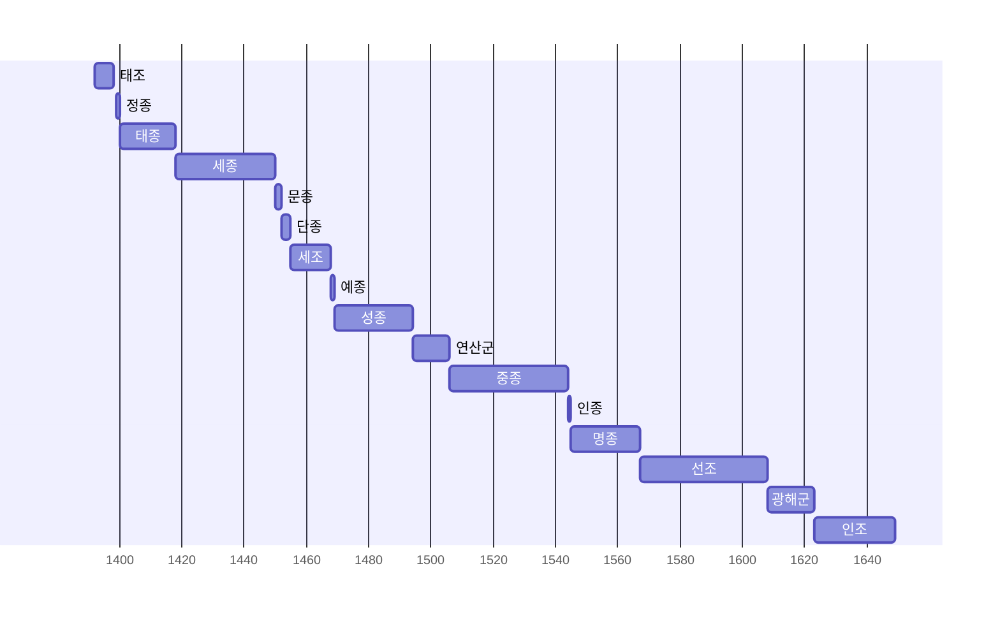
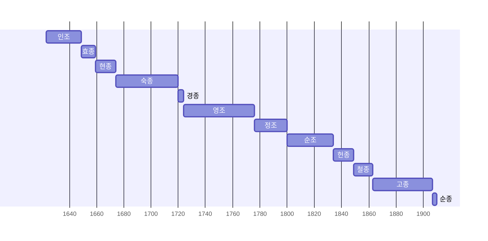
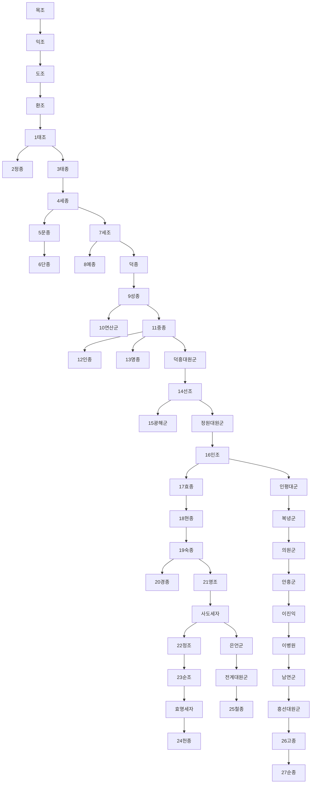

```mermaid
gantt

dateFormat YYYY
axisFormat %Y

태조: 1392, 1398
정종: 1399, 1400
태종: 1400, 1418
세종: 1418, 1450
문종: 1450, 1452
단종: 1452, 1455
세조: 1455, 1468
예종: 1468, 1469
성종: 1469, 1494
연산군: 1494, 1506
중종: 1506, 1544
인종: 1544, 1545
명종: 1545, 1567
선조: 1567, 1608
광해군: 1608, 1623
인조: 1623, 1649

```

```mermaid
gantt

dateFormat YYYY
axisFormat %Y

인조: 1623, 1649
효종: 1649, 1659
현종: 1659, 1674	
숙종: 1674, 1720
경종: 1720, 1724	
영조: 1724, 1776
정조: 1776, 1800	
순조: 1800, 1834
헌종: 1834, 1849
철종: 1849, 1863
고종: 1863, 1907
순종: 1907, 1910


```

```mermaid
graph TD

목조-->익조-->도조-->환조-->1태조-->2정종
1태조-->3태종-->4세종-->5문종-->6단종
4세종-->7세조-->8예종
7세조-->덕종-->9성종-->10연산군
9성종-->11중종-->12인종
11중종-->13명종
11중종-->덕흥대원군-->14선조-->15광해군
14선조-->정원대원군-->16인조-->17효종-->18현종-->19숙종-->20경종
19숙종-->21영조-->사도세자-->22정조-->23순조-->효명세자-->24헌종
사도세자-->은언군-->전계대원군-->25철종
16인조-->인평대군-->복녕군-->의원군-->안흥군-->이진익-->이병원-->남연군-->흥선대원군-->26고종-->27순종

```

