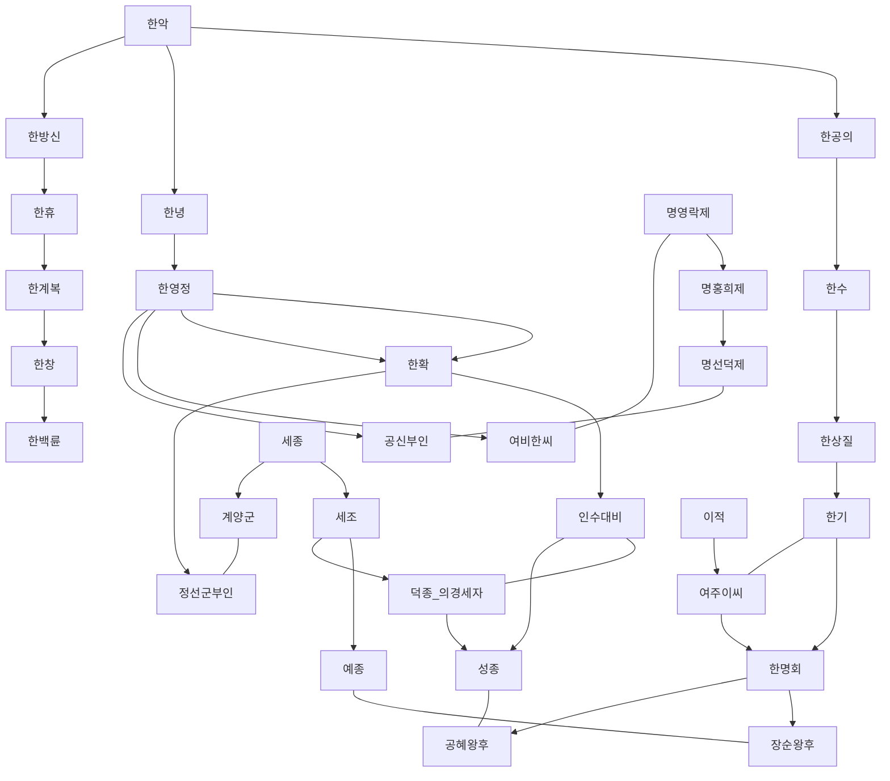

```mermaid
graph TD

    한악 ---> 한공의 ---> 한수 ---> 한상질
    한악 ---> 한녕 --> 한영정 --> 한확
    한악 ---> 한방신 --> 한휴 --> 한계복 --> 한창 --> 한백륜

    한영정 --> 한확 ---> 인수대비
    한확 --> 정선군부인

    세조 --> 예종
    세종 --> 세조 --> 덕종_의경세자 --> 성종

    인수대비 --- 덕종_의경세자

    명영락제 --> 명홍희제 --> 명선덕제
    세종 --> 계양군
    계양군 --- 정선군부인


    한영정 ---> 여비한씨
    한영정 ---> 공신부인

    명영락제 --- 여비한씨
    명선덕제 --- 공신부인


    한상질 --> 한기 --> 한명회
    한기 --- 여주이씨

    이적 --> 여주이씨 --> 한명회

    한명회 --> 장순왕후
    한명회 --> 공혜왕후

    예종 --- 장순왕후
    인수대비 --> 성종
    성종 --- 공혜왕후

```