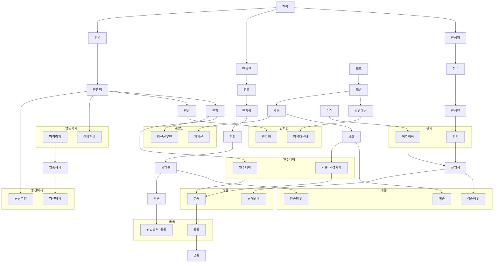

```mermaid
graph TD

    한악 ---> 한공의 ---> 한수 ---> 한상질
    한악 ---> 한방신 --> 한휴 --> 한계복 --> 한창 --> 한백륜
    한악 ---> 한녕 --> 한영정 --> 한확

    한확 ---> 인수대비
    한확 --> 정선군부인

    한영정 --> 한절
    한절 --> 한치형

    subgraph 한치형_
    한치형
    양녕대군녀
    end

    태조 --> 태종

    태종 --> 양녕대군 --> 양녕대군녀
    태종 --> 세종

    세조 --> 예종
    세종 --> 세조 --> 덕종_의경세자 --> 성종

    subgraph 인수대비_
    인수대비 
    덕종_의경세자
    end

    명영락제 --> 명홍희제 --> 명선덕제
    세종 --> 계양군

    subgraph 계양군_
    계양군
    정선군부인
    end


    한영정 ---> 여비한씨
    한영정 ---> 공신부인

    subgraph 명영락제_

    명영락제 
    여비한씨
    end
    
    subgraph 명선덕제_
    명선덕제 
    공신부인
    end


    한상질 --> 한기 --> 한명회

    subgraph 한기_
    한기 
    여주이씨
    end

    이적 --> 여주이씨 --> 한명회

    한명회 --> 장순왕후
    한명회 --> 공혜왕후

    한백륜 --> 안순왕후
    한백륜 --> 한순 --> 귀인한씨_중종

    subgraph 예종_
    예종
    장순왕후
    안순왕후
    end

    인수대비 --> 성종 --> 중종 --> 명종

    subgraph 성종_
    성종
    공혜왕후
    end
    
    subgraph 중종_
    중종
    귀인한씨_중종
    end

```