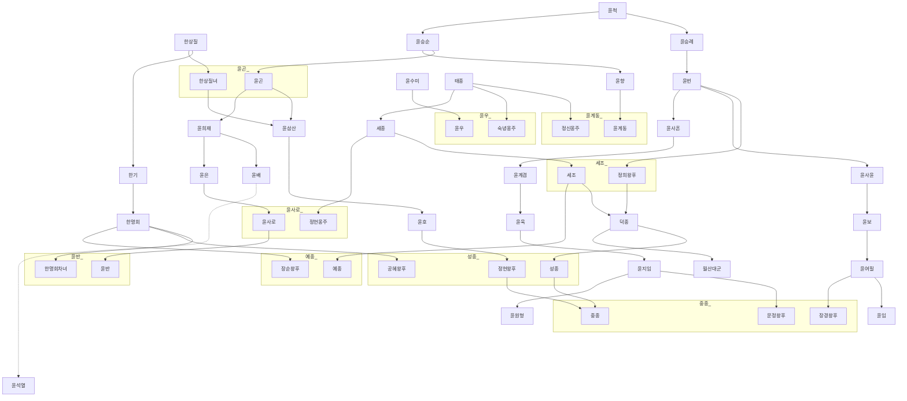

```mermaid

graph TD

한상질 --> 한기 --> 한명회

한상질 --> 한상질녀 --> 윤삼산

윤번 --> 정희왕후
윤번 --> 윤사윤 --> 윤보 --> 윤여필
윤여필 --> 윤임
윤여필 --> 장경왕후
윤번 --> 윤사흔 --> 윤계겸  --> 윤욱 --> 윤지임 --> 문정왕후
윤지임 --> 윤원형

윤척 --> 윤승례 --> 윤번
윤척 --> 윤승순 --> 윤곤 --> 윤삼산 --> 윤호 --> 정현왕후

윤승순 --> 윤향 --> 윤계동

윤수미 --> 윤우

태종 --> 정신옹주
태종 --> 숙녕옹주 

태종 --> 세종 --> 세조

윤곤 --> 윤희재 --> 윤배 -......-> 윤석열
윤희재 --> 윤은 --> 윤사로 --> 윤반
subgraph 윤반_
윤반
한명회차녀
end
한명회 --> 한명회차녀
한명회 --> 공혜왕후
한명회 --> 장순왕후

subgraph 윤사로_
윤사로
정현옹주
end
세종 --> 정현옹주

subgraph 윤계동_
윤계동
정신옹주
end

subgraph 윤우_
윤우
숙녕옹주
end


세조 --> 덕종 --> 성종 --> 중종
정희왕후 --> 덕종
정현왕후 --> 중종
덕종 --> 월산대군

subgraph 성종_
성종
정현왕후
공혜왕후
end

subgraph 세조_
세조
정희왕후
end

subgraph 윤곤_
윤곤
한상질녀
end

세조 --> 예종

subgraph 예종_
예종
장순왕후
end
subgraph 중종_
중종
문정왕후
장경왕후
end

```